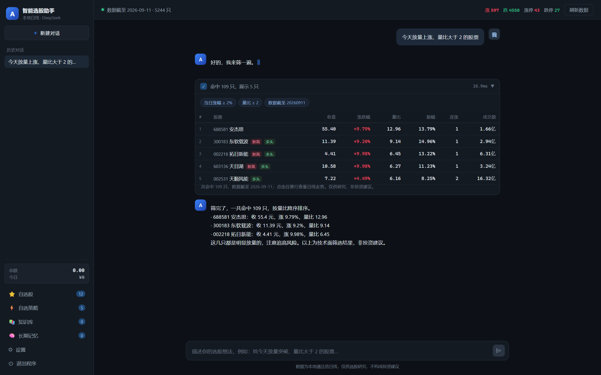
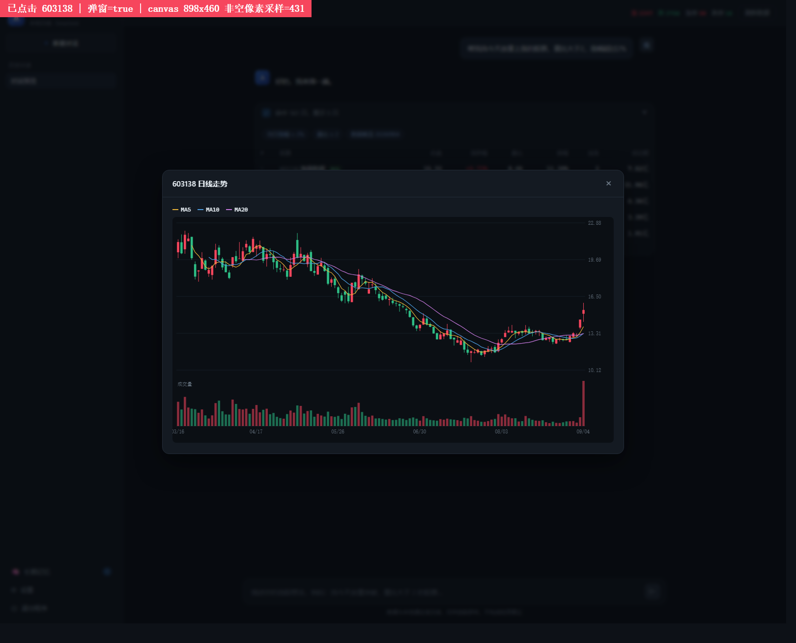

# A股智能选股助手（astock-agent）

一个跑在本机的**对话式选股 + 策略验证工具**：用大白话描述选股想法，助手把它翻译成筛选条件，
在本地通达信日线数据上跑一遍全市场（约 5200 只），返回候选股与命中逻辑；选出策略后还能**用历史数据回测**，
并给出**回测可信度**评估。

- **纯本地数据**：直接读通达信 `vipdoc` 日线，不联网抓行情，无需注册行情账号
- **对话式筛选**：接入 DeepSeek，支持工具调用与流式输出，聊天即可选股
- **策略回测**：按 A 股真实交易约束模拟（T+1、一字板不成交、停牌不交易、佣金与印花税）
- **回测可信度**：八项清单 + 样本外验证 + 参数扫描，拒绝用样本内结果自证策略有效
- **有记忆**：多轮会话持久化，并跨会话记住你的选股偏好
- **可打包**：`build.cmd` 一键打成单个 exe，双击即用

> 只做选股研究与策略验证，**不构成投资建议**，不涉及交易。

## 界面

对话选股，筛选结果直接用表格呈现，点任意一行看日线走势：





---

## 功能总览

### 一、对话选股
用大白话描述条件（"今天放量上涨、量比大于 2 的股票"），助手转成结构化筛选条件并给出结果表格；
也可以直接问数据状态、个股详情、看 K 线走势。**模型只负责"自然语言 → 条件"，筛选与计算全部由代码执行**，
从机制上避免模型把数字算错。

### 二、自选策略
把常看的选股条件存成一条策略，之后在对话里说"用我的放量上涨策略选股"就能直接跑。

- 支持新建 / 编辑 / 搜索 / 删除 / 试跑，可按条件文字搜索（输入"量比"能搜到含该条件的策略）
- 也可以让助手把一套条件总结成策略存进去（**没明确说保存时不会擅自保存**）
- 策略里可勾选"只看我的自选股"
- **删除 / 修改策略这类破坏性操作不交给模型**，由用户在面板完成

### 三、策略回测
用历史数据把这个策略实际交易一遍，看它到底能不能赚钱：输出总收益、最大回撤、胜率、盈亏比、
净值曲线、逐笔交易明细，**并且一定附同期大盘基准做对照**——收益为正不等于策略有效，要看有没有跑赢基准。

回测按真实交易约束计算，不做美化（详见下文"回测的设计原则"）。

### 四、回测可信度
每次回测结束，结果页最上面会给出「可信度」——**不是打分，而是一份清单**，逐条列出哪一项没过关：

```
可信度 · 偏低
  可信度偏低：样本外验证这一项没过关，结论不能作为依据。
  ✓ 交易笔数      303 笔，样本量充足
  ✓ 回测区间      244 个交易日（约 1 年以上）
  ✗ 样本外验证    未通过：样本内赚钱、样本外亏钱 —— 典型的过拟合
  · 参数稳定性    没做过参数扫描，不知道结果对参数是否敏感
  ✓ 收益集中度    最大单笔盈利占总盈利 2%，比较分散
  ✗ 相对基准      跑输沪深300 14.7 个百分点——没有超额价值
  ✓ 成交可执行性  因一字涨停没买进 0 次（占 0%），可执行性好
```

八项检查：交易笔数、回测区间、**样本外验证**、参数稳定性、**收益集中度**、相对基准、成交可执行性、数据质量。

> **核心规则：只做过单次回测的，可信度最高只能到「中等」（会标注"已封顶"）。**
> 因为单次回测是样本内结果，只能说明"历史上是这样"，不能说明"将来也这样"。
> 没有这条封顶，一个交易 600 次、跑赢基准、参数稳定的**过拟合**策略会被打成"高可信"——那比不打分更危险。

### 五、样本外验证与参数扫描
把区间切成几段：前一段调参、后一段拿**没见过的数据**检验，滚动推进，自动给出结论等级（可信 / 存疑 / 过拟合）。
另有参数扫描：同一批信号换多组止盈止损 / 持仓天数各跑一遍，看结果是否稳定——差一点就天差地别的，是碰巧凑出来的。

### 六、交易计划（决定什么时候卖）
光有买入条件没法回测，所以每条策略都带一套卖出规则：

- 最多持有 N 个交易日
- 止损线 / 止盈线
- 条件卖出：可从预设里挑（跌破均线、单日跌幅、量比、连跌、死叉、浮盈回落），也可以自己写表达式，例如 `收盘 < MA10 且 量比 < 0.8`
- 最多同时持有几只、单只仓位占比

### 七、知识库
把自己的交易纪律、选股流程等文档导进去（支持 md / txt / csv / docx），助手回答时会引用并**注明出处**。
**没有导入任何文档时，助手不会给出任何建议**——从机制上避免它凭空编。

### 八、通达信自选股
直接读取你在通达信里的自选股（**只读，不会改动你的通达信**），可以在对话里限定"只在我自选股里筛"。

### 九、用量与余额
左下角实时显示 DeepSeek 余额和今日花费。

---

## 回测的设计原则

回测里最容易自欺欺人的几个地方，这里全部按最保守的方式处理：

| 场景 | 处理方式 |
|------|----------|
| 信号产生 | T 日收盘产生信号 → **T+1 开盘买入**，绝不用当日收盘价成交（那等于偷看未来） |
| 一字涨停 | **买不进** → 跳过这笔信号（A 股最常见的回测虚高来源） |
| 一字跌停 | **卖不出** → 顺延到下一交易日 |
| T+1 制度 | 当天买入当天不能卖 |
| 停牌 | 当天没有 K 线 → 不交易 |
| 交易成本 | 买入佣金 0.025%（最低 5 元）；卖出佣金 + 印花税 0.05% |
| 资金约束 | 现金不足就买不了，不做杠杆 |
| 止损 / 止盈同日触发 | 按**先止损**处理（更保守） |

一句话原则：**宁可把结果算难看，也不能算好看。**

## 数据准确性与复权

通达信存的是**不复权**价格。股票除权除息（送转、分红）后价格会跳变，例如 10 送 10 会显示成一根 -50% 的巨阴线；
不处理的话，回测会把它当成真实暴跌而触发止损，均线 / 涨跌幅 / 创新高这些指标在除权日附近也会算错。

通达信的股本变迁文件是加密格式、解析不了，所以本程序用**涨跌停**作判据：A 股有涨跌停限制，
任何超过限额的单日跳变必然是除权，据此自动做前复权。实测全市场 5251 只里有 410 只（7.8%）存在这类跳变，
**处理后可降到 0.9%**，剩下的都是合法的无涨跌幅限制日（次新股上市初期、长期停牌复牌）。

另外，程序保证「实时选股」和「回测」用的指标口径**完全一致**——有 14 个用例在全市场 5183 只上逐日比对，结果必须完全相同。

## 性能

| 操作 | 耗时（本机实测） |
|------|------------------|
| 任意条件组合筛选 | 10ms 级（指标已缓存进 SQLite） |
| 回测（近 1 年） | 约 6 秒 |
| 回测（近 3 年） | 约 20 秒（多进程并行，默认 4 进程） |

---

## 目录结构

```
astock-agent/
├── astock.py              顶层入口（打包用）
├── astock-agent.spec      PyInstaller 打包配置
├── build.cmd              一键打包脚本（双击即可）
├── dev.cmd                开发模式启动（改完代码立即生效，不用打包）
├── package.cmd            生成给别人用的干净压缩包（不含你的密钥和聊天记录）
├── app/
│   ├── main.py            程序入口：起服务、开浏览器、首次建缓存
│   ├── server.py          HTTP 服务 + REST API + SSE 流式对话
│   ├── agent.py           Agent 主循环：模型 → 工具 → 回填 → 再问
│   ├── config.py          配置（路径、API Key、模型）
│   ├── strategies.py      自选策略（条件定义、存储、按名执行）
│   ├── usage.py           DeepSeek 用量与余额
│   ├── engine/            选股引擎
│   │   ├── tdx.py             通达信 .day 解析
│   │   ├── adjust.py          前复权（涨跌停判据）
│   │   ├── indicators.py      指标计算
│   │   ├── names.py           股票名称（通达信 TNF 解析）
│   │   ├── store.py           全市场扫描 + SQLite 指标缓存
│   │   ├── screener.py        条件筛选 + 排序 + 统计
│   │   └── watchlist.py       读取通达信自选股（只读）
│   ├── backtest/          策略回测
│   │   ├── engine.py          回测引擎（交易约束、成本、止损止盈）
│   │   ├── credibility.py     回测可信度八项评估
│   │   ├── data.py            回测数据装载与复权
│   │   └── expr.py            条件卖出表达式
│   ├── kb/                知识库（导入 / 切分 / 索引 / 引用）
│   ├── llm/               大模型接入
│   │   ├── client.py          DeepSeek 客户端（流式 + 工具调用）
│   │   ├── prompts.py         系统提示词
│   │   └── tools.py           工具定义与执行
│   ├── memory/store.py    会话历史 + 长期记忆
│   └── web/               前端（原生 HTML/CSS/JS，无外部依赖）
├── tools/                 开发调试与自测脚本（不参与打包）
└── 知识库测试样例/         7 份示例文档（交易纪律、选股流程等）
```

## 快速开始

### 1. 直接运行（开发模式）

```powershell
cd astock-agent
python -m app.main
```

浏览器会自动打开 `http://127.0.0.1:8760`。

### 2. 打包成单文件 exe

```powershell
build.cmd
# 产物：dist\astock-agent.exe
```

双击 exe 即可运行，它会自己起服务并打开浏览器。

### 3. 首次使用要配置

点左下角 **设置**：

| 配置项 | 说明 |
|--------|------|
| DeepSeek API Key | 在 platform.deepseek.com 申请。只保存在本机数据目录，不会外传 |
| 通达信 vipdoc 目录 | **通常不用填**：程序会自动在各磁盘常见位置查找通达信数据目录。只有自动找不到时才需要手动指定 |
| 模型 | 默认 `deepseek-flash`（V4.1 Flash）。**`deepseek-chat` / `deepseek-reasoner` 已于 2026-07-24 下线**，不要再用 |
| 思考模式 | 默认开启：模型先输出推理过程再作答，质量更好但更慢；关闭后响应更快 |

配好后点顶栏 **刷新数据** 建立缓存（首次全量扫描需要一会儿，之后按需增量）。

## 数据说明

- 数据源是本机通达信 `vipdoc\{sh,sz}\lday\*.day`，需要先在通达信客户端里**下载/刷新盘后数据**
- 盘中当天的日线要等收盘后通达信写入文件才会有
- 股票名称从通达信 `T0002\hq_cache\{shm,szm,bjm}.tnf` 解析（覆盖约 98%），取不到时只显示代码
- 只有 OHLCV 派生指标：**没有**市盈率、市净率、市值、换手率、财务数据
- 程序把全市场指标算好后缓存进 SQLite，所以筛选是毫秒级的；只有「刷新数据」才重新扫描

## 可用的筛选维度

收盘价区间、当日涨跌幅、5/20 日涨幅、量比、振幅、近 20 日平均振幅、连涨天数、
成交额、创 20/60 日新高、均线多头排列、距 60 日高点回撤、板块（沪市主板/科创板/深市主板/创业板）。

排序：涨跌幅、5/20 日涨幅、量比、振幅、连涨天数、收盘价、成交额、距 60 日高点。

## 记忆机制

| 类型 | 存在哪 | 作用 |
|------|--------|------|
| 会话历史 | `messages` 表 | 支持多轮追问，重启程序后仍在 |
| 长期记忆 | `memories` 表 | 跨会话记住偏好、常用策略；每次对话自动注入系统提示 |

长期记忆有两个来源：助手在每轮对话后自动提炼（可在设置里关闭），以及你手动添加。

**在哪看**：点左下角 **长期记忆** 面板，可以查看、手动添加、逐条删除。
数据都在程序旁的 `data\astock.db` 里（`memories` 表 / `messages` 表），用任何 SQLite 工具都能直接打开。

## 改人设和提示词

系统提示词写在 `app\llm\prompts.py` 的 `BASE_PROMPT` 里（助手的身份、能力边界、工具使用规范）。

> ⚠️ **改完必须重新打包才生效。** exe 里装的是打包那一刻的代码副本，
> 编辑 `.py` 源文件不会影响已经生成好的 exe。

```powershell
build.cmd        # 重新生成 dist\astock-agent.exe
```

重新打包不会动 `dist\data\`，你的 API Key、对话历史和长期记忆都会保留。
开发调试时也可以直接 `python -m app.main` 运行，这样改完立即生效、不用打包。

### 思考模式与 reasoning_content

DeepSeek V4 默认开启思考模式，模型先输出思维链（`reasoning_content`）再作答，界面上会显示「正在思考…」。

这里有个容易踩的坑：按官方要求，**请求带 `tools` 时，历史轮次的 `reasoning_content` 必须回传**。
本程序把思维链连同消息一起落库，并在后续请求中回传——否则多轮工具调用会缺上下文。
另外思考模式下 `temperature` 不生效，程序在开启思考时不会发送该参数。

## 数据存放位置

默认放在**程序旁边**的 `data\` 目录（配置、数据库、日志），也就是 exe 同级的 `data\`：

- 拷走整个文件夹 = 连对话历史、长期记忆一起带走（绿色便携）
- 删掉 `data\` 目录 = 完全重置（重新扫描一次约 1 秒）
- 占用很小：行情缓存约 1.1 MB，且刷新不会让它变大（每次重建而非追加）

如果程序放在不可写的目录（例如 `C:\Program Files\`），会自动退回到 `%LOCALAPPDATA%\astock-agent\`；
也可以用环境变量 `ASTOCK_DATA_DIR` 强制指定。

## 架构说明

**为什么后端只用标准库？**
`http.server` + `urllib` + `sqlite3` 足够支撑本地单用户场景，换来的是：
零运行时依赖、打包体积小、不会出现 FastAPI/uvicorn 那类隐藏导入导致的打包失败。

**为什么用 SQLite 缓存指标？**
全市场约 5200 只股票，逐个读 `.day` 再算指标需要遍历整个数据目录。
把结果缓存成一张指标表后，任何条件组合的筛选都退化成一次 SQL 查询（10ms 级别）。

**为什么打包后默认单进程扫描？**
onefile 模式下多进程会派生新的解释器实例，启动更慢也更容易被杀软拦截。
单进程扫描在热缓存下 1 秒左右完成；需要更快可设 `ASTOCK_WORKERS=4`。
（回测默认走多进程，设为 1 可关闭。）

## 分享给别人用

**⚠️ 千万不要直接把 `dist` 文件夹压缩发出去。**

程序运行后会把数据存在 exe 同级的 `data\` 目录里，其中包括：

| 文件 | 内容 |
|------|------|
| `data\config.json` | **你的 DeepSeek API Key** |
| `data\astock.db` | **你的全部对话历史和长期记忆** |

把整个文件夹发出去，等于把密钥和聊天记录一起送人（密钥会被人拿去用你的额度）。

**正确做法**——用打包脚本生成干净压缩包：

```powershell
package.cmd
# 产物：发布\astock-agent.zip
# 内容：astock-agent.exe + 使用说明.txt（仅此两项）
```

对方拿到后：双击运行 → 在设置里填**他自己的** API Key → 刷新数据即可。
通达信目录一般能自动找到，不用他手动配。

## 自测

```powershell
python tools\e2e_test.py                    # 端到端：用本地 Mock 大模型跑通「对话 → 工具 → 结果 → 记忆」全链路（28 项断言，不需要 API Key）
python tools\check_frontend.py              # 前端一致性：JS 引用的元素 ID / CSS 类是否都真实存在
python tools\bench_engine.py                # 引擎性能：全市场扫描与筛选耗时
python tools\bench_backtest.py              # 回测性能
python tools\check_backtest_consistency.py  # 选股与回测的指标口径一致性（14 用例 × 全市场逐日比对）
python tools\seed_strategies.py             # 播种 5 条示例策略
```

`e2e_test.py` 会在 `_e2e\` 下用独立的数据目录跑，不会污染你的正式数据。
策略相关的验收用例与判定标准见 [`策略测试用例.md`](策略测试用例.md)。

## 环境要求

- Windows（路径与打包脚本按 Windows 写）
- Python 3.10+（打包后的 exe 不需要装 Python）
- 一个 DeepSeek API Key
- 本机装有通达信且日线数据已刷新

## 免责声明

本工具仅用于技术研究与选股学习，所有结果不构成任何投资建议。
数据来自本地通达信日线文件，可能存在滞后或缺失。回测结果基于历史数据，历史表现不代表将来收益。据此操作，风险自负。
